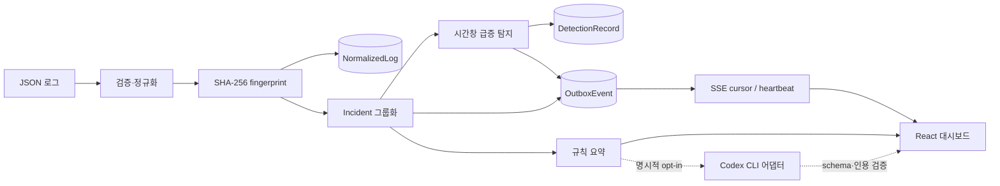
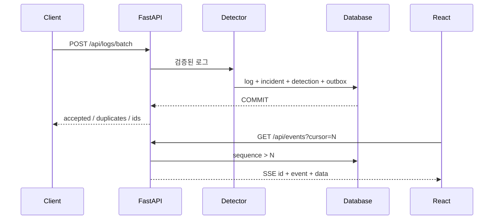

# 아키텍처

## 설계 목표

AI가 없어도 로그 수집부터 장애 그룹화, 급증 탐지, 상태 관리, 근거 기반 요약까지 동작해야 합니다. 같은 입력은 같은 결과를 만들고, 재수집·재시작·SSE 재연결 때 중복이나 누락을 줄이는 것을 우선했습니다.

## 컴포넌트

| 영역 | 책임 | 주요 파일 |
|---|---|---|
| API | 입력 검증, 검색, 상태 전이, SSE | `backend/app/main.py`, `schemas.py` |
| 분석 | 메시지 정규화, fingerprint, 급증 탐지 | `backend/app/logs.py` |
| 저장 | SQLAlchemy 모델, SQLite migration, PostgreSQL 선택 | `models.py`, `database.py` |
| 설명 | 규칙 요약과 선택적 Codex CLI 검증 | `summary.py` |
| UI | 목록·필터·상세·타임라인·근거·실시간 상태 | `frontend/src/App.tsx` |
| 검증 | pytest, Vitest, Playwright, audit, CI | `backend/tests`, `frontend/e2e`, `.github/workflows/verify.yml` |

## 데이터 흐름과 원자성

`POST /api/logs/batch`는 최대 1,000건을 한 요청으로 받습니다. timestamp는 UTC로 바꾸고 텍스트 공백, 메시지 20,000자, attributes 64 KiB를 검증합니다. 서비스와 정규화 메시지를 합쳐 SHA-256 fingerprint를 계산합니다.

로그 저장, incident 연결, 최초 상태 이력, 급증 detection, outbox event는 같은 SQLAlchemy transaction에서 commit됩니다. 중간 오류가 나면 전체 요청을 rollback합니다.

## 중복과 재발 처리

- `NormalizedLog.external_id`: 같은 원본 로그 재수집을 멱등 처리합니다.
- `Incident.fingerprint`: 동일 오류 패턴을 한 incident에 묶습니다.
- 해결된 incident에 같은 fingerprint의 새 오류가 들어오면 `resolved → open` 이력을 남기고 다시 엽니다.
- `DetectionRecord.dedupe_key`: 같은 fingerprint·시간 bucket의 급증을 한 번만 기록합니다.
- `OutboxEvent.dedupe_key`: incident·상태·급증 이벤트의 중복 발행을 막습니다.

## SSE 복구

Outbox event에는 UUID와 별도로 단조 증가 `sequence`가 있습니다. 브라우저는 마지막 이벤트 ID를 자동 전송하고, API는 `Last-Event-ID` 또는 `cursor`보다 큰 event만 순서대로 반환합니다. event가 없을 때 heartbeat comment를 보내 idle 연결을 유지합니다.

## SQLite migration

초기 scaffold DB에는 `outbox_events.sequence`와 dedupe 열이 없었습니다. `create_all()`은 기존 테이블을 변경하지 않으므로 versioned startup migration을 추가했습니다. migration은 legacy outbox를 새 테이블로 옮기면서 데이터와 순서를 보존하고, 실행 이력을 `schema_migrations`에 기록해 재실행을 막습니다. PostgreSQL은 신규 schema 생성 경로만 검증했으며 운영 migration은 향후 Alembic으로 확장해야 합니다.

## AI 경계

Codex CLI는 탐지 결과를 결정하지 않습니다. 최근 최대 20개 로그의 ID·severity·1,000자 이하 message만 입력하며 로그 문자열은 신뢰할 수 없는 데이터로 취급합니다. 공식 `codex login status`가 ChatGPT 로그인을 확인하고 Windows read-deny 준비 표시가 있을 때만 실행합니다.

결과는 strict JSON schema, Pydantic strict model, `source=codex_cli`, 입력 집합 안의 `evidence_log_ids`를 모두 만족해야 합니다. 실패·timeout·위조 인용·출력 초과 시 규칙 요약을 유지합니다. 유료 API나 API key fallback은 없습니다.

## 배포 구성

기본 Compose는 API + Nginx 정적 프런트엔드 + SQLite volume입니다. override는 PostgreSQL 16을 선택합니다. 로컬에서 Docker 실행 파일이 없어 Compose live smoke는 미검증이며 이 사실을 CI 성공이나 배포 성공으로 표현하지 않습니다.
