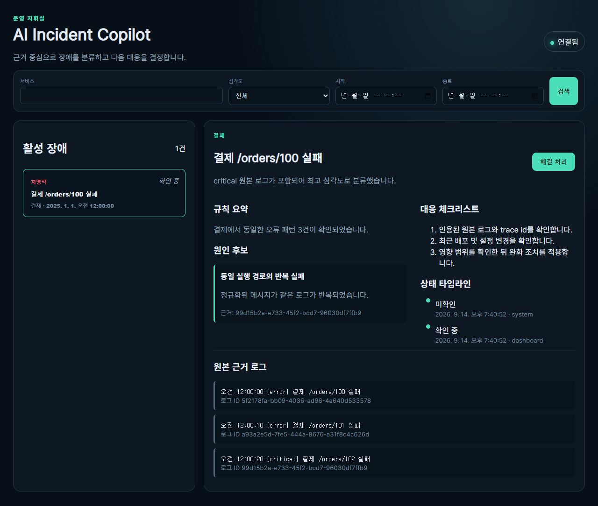

# AI Incident Copilot

> 여러 서비스의 JSON 로그를 같은 장애 단위로 묶고, 발생 흐름·원인 후보·대응 근거를 한 화면에 보여주는 신입 백엔드·풀스택 개발 포트폴리오입니다.

[](https://github.com/Rinhaze/ai-incident-copilot/actions/workflows/verify.yml)

| 10초 요약 | 내용 |
|---|---|
| 해결한 문제 | 개발자가 여러 서비스 로그를 일일이 검색하며 같은 장애를 반복 확인하는 비용 |
| 핵심 구현 | 로그 정규화와 SHA-256 fingerprint, 시간창 급증 탐지, incident 상태·타임라인, 영속 SSE, 근거 인용 요약 |
| 기술 | Python 3.12, FastAPI, SQLAlchemy, SQLite/PostgreSQL, React 18, TypeScript, Vite, Docker Compose |
| 검증 근거 | pytest **23개**, Vitest **3개**, 실제 Edge Playwright E2E **1개**, production build 통과 |
| AI 원칙 | 규칙 기반 기능이 기본이며 Codex CLI 요약은 선택 기능입니다. 외부 유료 API 없이 전체 핵심 흐름이 동작합니다. |



## 핵심 기능

- UUID, 숫자 ID, IP·포트, 긴 16진수, 경로의 동적 segment를 정규화해 같은 오류를 안정적으로 그룹화합니다.
- `error`·`critical` 로그를 incident에 연결하고 설정 가능한 시간창·임계치로 급증을 감지합니다.
- `external_id`와 detection/outbox dedupe key의 unique constraint로 재수집과 재시작 중복을 막습니다.
- 서비스·심각도·상태·기간으로 검색하고, 미확인 → 확인 중 → 해결 흐름을 타임라인에 남깁니다.
- 단조 증가 outbox sequence와 `Last-Event-ID`로 재연결 가능한 Server-Sent Events를 제공합니다.
- 규칙 요약은 원인 후보·대응 체크리스트·원본 log ID를 분리해 보여줍니다.
- 선택적 Codex CLI 결과는 strict JSON schema와 허용된 log ID 인용을 모두 통과해야 표시됩니다.

## 빠른 실행

### Windows PowerShell

```powershell
cd backend
py -3.12 -m venv .venv
.\.venv\Scripts\python.exe -m pip install -r requirements.txt
.\.venv\Scripts\python.exe -m app.sample_data --seed 0
.\.venv\Scripts\python.exe -m uvicorn app.main:app --host 127.0.0.1 --port 8000
```

새 PowerShell에서 프런트엔드를 실행합니다.

```powershell
cd frontend
npm ci
npm run dev
```

브라우저에서 `http://127.0.0.1:5173`을 엽니다. 같은 seed를 다시 넣으면 중복 로그로 처리되므로 데모 상태를 반복 재현할 수 있습니다.

### Docker Compose

```bash
docker compose up --build
```

PostgreSQL 선택 구성은 다음과 같습니다.

```bash
docker compose -f docker-compose.yml -f docker-compose.postgres.yml --profile postgres up --build
```

현재 개발 PC에는 Docker가 없어 Compose live smoke는 실행하지 못했습니다. YAML과 이미지 빌드는 GitHub Actions 및 Docker 설치 환경에서 확인할 수 있습니다.

## 검증

Windows에서는 전체 로컬 검사를 한 명령으로 실행합니다.

```powershell
.\scripts\verify.ps1
```

개별 명령은 다음과 같습니다.

```powershell
cd backend
.\.venv\Scripts\python.exe -m pytest -q
.\.venv\Scripts\python.exe -m pip_audit -r requirements.txt --progress-spinner off

cd ..\frontend
npm test -- --run
npm run build
npm audit --audit-level=high
npx playwright test --config playwright.config.ts
```

2026-09-15 로컬 최종 검증에서 Python·npm 공개 취약점은 각각 0개였습니다. Docker·PostgreSQL과 선택적 Codex live 요약은 [검증 기록](docs/VALIDATION.md)에 미검증 범위를 분리했습니다.

## API 예시

```bash
curl -X POST http://127.0.0.1:8000/api/logs/batch \
  -H "Content-Type: application/json" \
  -d '{"logs":[{"external_id":"demo-1","service":"payments","severity":"error","message":"POST /orders/4101/capture failed from 10.20.0.11","timestamp":"2025-01-01T09:00:00Z","attributes":{"scenario":"payment-timeout"}}]}'
```

```bash
curl "http://127.0.0.1:8000/api/incidents?service=payments&severity=error"
curl -N "http://127.0.0.1:8000/api/events?cursor=0"
```

요청·응답과 상태 변경 예시는 [API 사용법](docs/API.md)에 정리했습니다.

## 설계에서 검증까지

- [아키텍처](ARCHITECTURE.md): 컴포넌트, 데이터 모델, 트랜잭션·SSE·AI 경계
- [문제 해결 기록](docs/PROBLEM_SOLUTION.md): 문제 → 원인/제약 → 구현 → 검증 → 결과/배움
- [데모 시나리오](docs/DEMO.md): 스크린샷을 재현하는 샘플 장애 흐름
- [검증 기록](docs/VALIDATION.md): 실제 실행 결과와 미검증 항목
- [트러블슈팅](docs/TROUBLESHOOTING.md): 포트, DB migration, Edge, Docker 문제
- [면접 설명](INTERVIEW.md): 1분 소개, 기술 선택, 실패와 수정 근거

## 선택적 Codex CLI 요약

기본값은 OFF입니다. 규칙 기반 요약만으로 모든 핵심 기능이 동작합니다. 선택 기능은 ChatGPT 로그인을 확인한 Codex CLI와 Windows read-deny 준비 상태가 모두 검증된 환경에서만 켭니다.

```powershell
$env:CODEX_SUMMARY_ENABLED='true'
$env:CODEX_WINDOWS_READ_DENY_READY='true'
$env:CODEX_EXECUTABLE='C:\path\to\codex.exe'
```

실행은 `shell=False`, argv 배열과 stdin을 사용합니다. API key 환경변수는 전달하지 않으며 `gpt-5.6-sol`, strict output schema, timeout, 출력 크기, 입력 evidence ID를 검사합니다. 조건을 충족하지 못하면 한국어 오류와 함께 규칙 요약으로 돌아갑니다.

## 현재 한계

- 인증·멀티테넌시·복잡한 클라우드 배포는 MVP 범위에서 제외했습니다.
- SQLite migration은 최초 scaffold schema에서 현재 schema로 올리는 한 경로입니다. 장기 운영에는 Alembic 기반 migration 체계가 필요합니다.
- 단일 프로세스 SQLite 기준이며 높은 동시 쓰기는 PostgreSQL과 별도 부하 검증이 필요합니다.
- 성능 수치는 운영 성능으로 공개하지 않습니다. `scripts/benchmark.ps1` 결과는 개발 환경 회귀 비교 용도로만 사용합니다.

## 개발 및 검증 방식

로그 정규화, fingerprint 기반 그룹화, 시간창 급증 탐지, SSE 재연결을 각각 독립된 계약으로 나누어 구현했습니다. 기능 완성 여부는 설명이 아니라 pytest, Vitest, production build, 실제 Edge E2E, dependency audit와 Git 보안 검사 결과로 판단했습니다.
